# When Hill Climbing Isn't Enough

<p class="report-subtitle">RegimeBench</p>
<p class="report-author">Amit Patel<br><a href="mailto:amitvpatel06@gmail.com">amitvpatel06@gmail.com</a></p>

<style>
body {
  max-width: 68rem;
}

p,
li {
  text-align: justify;
}

.report-subtitle {
  color: #4b5563;
  font-size: 1.35em;
  margin-bottom: 0.15em;
  margin-top: -0.65em;
  text-align: left;
}

.report-author {
  color: #374151;
  font-size: 0.98em;
  line-height: 1.25;
  margin-bottom: 1.1em;
  margin-top: 0;
  text-align: left;
}

table {
  display: block;
  overflow-x: auto;
  width: 100%;
  font-size: 0.9em;
}

.figure-caption {
  color: #1f2937;
  font-size: 0.98em;
  line-height: 1.35;
  margin: -0.35em auto 1.1em;
  max-width: 58rem;
  text-align: center;
}

th,
td {
  padding: 0.28em 0.45em;
  vertical-align: top;
}

@media print {
  body {
    max-width: none;
    padding: 0.35in;
    font-size: 10.5pt;
  }

  table {
    display: table;
    overflow: visible;
    width: 100%;
    font-size: 7.6pt;
    line-height: 1.18;
    break-inside: avoid;
    page-break-inside: avoid;
  }

  th,
  td {
    padding: 0.16em 0.24em;
  }

  #benchmark-results {
    break-before: page;
    page-break-before: always;
  }
}
</style>

### Abstract

RegimeBench is a benchmark for measuring automated research judgment: whether LLM coding agents can form, test, and revise hypotheses when they receive limited proxy feedback but are ultimately judged out-of-distribution. The setup is designed to stress a gap in current LLM training and evaluation: models are often rewarded for local hill climbing against visible signals, but many real-world settings require judgment about when feedback is misleading, when a hypothesis has stopped improving, and whether an apparent gain will survive a distribution shift. We instantiate this as cross-sectional stat-arb signal research using crypto perpetual futures data because it provides fast, auditable feedback loops and a naturally shifted hidden evaluation set. Agents implement candidate signals, decide how to spend a limited iteration budget on in-sample feedback, and submit code snapshots that are later replayed through a PnL verifier on out-sample data.


The benchmark is not designed to teach or discover deployable trading strategies: the out-sample performance of models is modest and measured pre-cost, and the trading domain is used primarily as a controlled OOD research task. The central question is whether models can use scarce feedback to make better research decisions without merely overfitting the visible proxy. Across Codex, Claude Code, Gemini, and DeepSeek, we saw that iteration can create out-sample gains, but its value is front-loaded: the largest average-signal out-sample Sharpe gains often arrive by the second iteration, while later iterations add little, wobble, or reverse earlier gains. As agents iterate, their task-level PnL streams also become more correlated across tasks, suggesting that models systematically converge toward shared factor families: a lot of that shared alpha is correlated with simple residual-return mean reversion. The takeaway is not that hill climbing is useless; it is that hill climbing alone is an incomplete recipe for automated research. Models need the judgment to decide which feedback to trust, when to stop, and when a locally rewarded idea is unlikely to generalize.

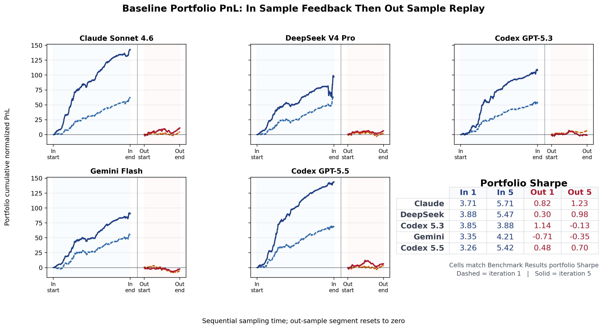

<p class="figure-caption">Each panel shows one baseline agent. Blue lines are cumulative portfolio PnL on the in-sample feedback window after either one or five iterations; orange/red lines are the same submitted snapshots replayed on the out-sample window. The table reports only portfolio Sharpe, using the same values as the Benchmark Results section: in-sample columns come from the in-sample companion table, and out-sample columns come from the headline out-sample table. The out-sample segment starts after the in-sample segment and resets to zero, so the figure compares how iteration changes visible fit versus held-out generalization rather than showing one continuous trading period.</p>


## Motivation

RegimeBench measures a broad question in model evaluation: what happens when an agent can repeatedly optimize against visible feedback, but final performance is judged under distribution shift?

### Where Else This Pattern Applies

Finance and markets are a useful stress test because distribution shift is explicit and measurable, but the same evaluation pattern applies to many agentic research settings:

- **Drug discovery and biology:** a model optimizes candidates against proxy assays, docking scores, or public benchmarks, while real value depends on wet-lab validation, toxicity, manufacturability, and patient heterogeneity.
- **Medicine and clinical decision support:** a model iterates on retrospective validation cohorts, but deployment performance depends on new hospitals, changing practice patterns, rare subpopulations, and prospective outcomes.
- **Materials science:** a model searches over compounds using simulated properties or small experimental datasets, then faces distribution shift when candidates are synthesized and tested under real manufacturing constraints.
- **Cybersecurity:** an agent may optimize against known challenge suites or visible scanners, while real robustness depends on adaptive attackers and unseen exploit surfaces.
- **Operations and forecasting:** a model tunes policies or forecasts to historical data, but must generalize to supply shocks, new customer behavior, outages, or other regime changes.
- **Marketing and Strategy:** a model may capture a population's behavior, interests, or preferences today, but a useful strategy must keep working as tastes and market conditions change.

The common structure is the same: repeated iterative feedback improves performance on a visible proxy, while the real objective lives on a hidden shifted distribution. The model's goal is to develop hypotheses that are robust across changing conditions. Benchmarks for these domains should therefore report performance curves over iteration budgets, include hidden or prospective evaluation sets, and measure whether additional attempts improve transfer or merely sharpen proxy overfit.


## Task Suite

Each task in the benchmark gives an agent a market hypothesis, point-in-time perpetual futures
data, starter code, and a limited iteration budget. Each iteration corresponds
to a `/check` call in the task interface. A candidate edit
produces observable feedback such as IC, t-stat, Sharpe, calibration tables,
decay diagnostics, and backtest summaries. The agent uses that signal to choose
the next edit, but the final question is whether those improvements transfer to
shifted out-sample data. There are 18 signal meta-tasks, which can be
used to generate variants by changing the in-sample and out-of-sample windows
and the allowed feature columns.

Each signal task asks for a dataframe keyed by timestamp and ticker with a
single `signal` column. The tasks differ by hypothesis and allowed feature
families, including volume, funding, market structure, volatility, seasonality,
pair clusters, DeFi data, Upbit premium, top-trader positioning, and simple
machine-learning variants.

For example, `signal-volume` asks the agent to test whether volume-derived
features contain incremental information about future residualized crypto
returns beyond recent price movement. The task exposes hourly rows with
`timestamp_agg`, `ticker`, `close`, `volume`, `return`, `return_lag1`,
`funding_rate`, `residual_return`, `residual_return_lag1`, and
`is_prediction_period`. The submitted code must implement `build_signal` and
return only `timestamp_agg`, `ticker`, and a finite floating-point `signal`,
where larger values mean larger expected forward return. A simple baseline
candidate might compute relative volume against a rolling per-ticker baseline,
multiply it by the sign of a safe lagged or point-in-time price move, and rely
on the evaluator to cross-sectionally z-score and clip the signal before
backtesting. Better agents are expected to explore whether volume spikes imply
continuation, exhaustion/reversal, or regime-dependent behavior conditioned on
funding, volatility, or trend state.

The important benchmark property is that the same interface is reused across
tasks while the hypothesis changes. In `signal-funding`, the research question
centers on crowded perpetual positioning; in `signal-weekly-seasonality`, it
centers on calendar structure; in `signal-defillama`, it centers on DeFi-derived
features. This makes the suite broad enough to measure research judgment while
keeping the submission contract fixed.

The benchmark treats iteration budget as an experimental intervention,
not just an implementation detail. A 1-iteration run measures something closer to
first-pass research judgment while a 5-iteration run measures the model's ability to
search against a visible reward while avoiding proxy overfit. Results should be
reported as curves over feedback budgets and iterations.

## Target Creation

The signal tasks are scored on factor-residualized returns rather than raw
crypto returns. Upstream preprocessing first computes a close-to-close
per-asset `return` and a contemporaneous `market_return`, defined in the current
residualizer as the average of BTCUSDT and ETHUSDT returns. It then builds
common exposure controls such as rolling market beta (`beta_mkt`), a
cross-sectional liquidity factor z-score derived from one-day volatility,
volume, and VWAP, and funding rate. For each timestamp, a cross-sectional OLS
regression fits `return` on an intercept plus these exposure columns. The fitted
component is saved as `predicted_return`, and the benchmark target is the
leftover asset-specific component:

```text
residual_return = return - predicted_return
```

This is a Fama-MacBeth-style residualization step: it asks whether an agent can
find signals that predict the part of crypto returns not explained by broad
market movement and common style/liquidity exposures. The task generation code
does not refit this model during an experiment. It loads the precomputed
residualized parquet bundle and passes through columns such as `return`,
`residual_return`, `market_return`, `predicted_return`, and safe lag features
like `residual_return_lag1`.

During scoring, the evaluator sets the active return column to
`residual_return`. The submitted signal at time `t` is aligned with the next-bar
residual return for the same ticker; IC is computed per timestamp as the mean of
`signal_t * residual_return_{t+1}`, and the backtest uses the cross-sectionally
z-scored and clipped signal as portfolio weights against the residual-return
matrix. Hidden prediction-period return labels are nulled in the feature view
given to submitted code, so agents can train on earlier visible rows but cannot
read the held-out residual returns they are being scored against.

## Benchmark Interface And Replay

Each task presents the agent with a small coding interface rather than a
multiple-choice or static prediction problem. For signal tasks, the core
contract is:

```python
def build_signal(data_path: str) -> pl.DataFrame:
    ...
```

The returned dataframe must contain:

```text
timestamp_agg, ticker, signal
```

Higher `signal` should mean higher expected forward return. The starter script
loads `/app/data/train.parquet`, calls `build_signal`, validates the schema, and
writes `/app/output/signal.parquet`. The task instructions also constrain what
features may be used and require point-in-time behavior: a model may create
training labels for visible analysis only when the rows used for fitting are
strictly earlier than the rows being predicted.

The live interaction is an iterative coding loop. A simplified episode looks
like this:

```text
Attempt 0
  Agent opens starter code and task instructions.
  build_signal raises NotImplementedError.

Attempt 1
  Agent implements a simple volume or funding z-score.
  Agent runs the visible feedback evaluator.
  The visible evaluator returns IC, t-stat, Sharpe, calibration, decay, and backtest
  diagnostics, then saves code_001.py and result_1.json.

Attempt 2
  Agent revises the signal, for example adding cross-sectional normalization,
  regime conditioning, or a decay/turnover control.
  Agent runs another feedback iteration.
  The evaluator saves code_002.py and result_2.json.

Attempt 3
  Agent either keeps improving, restores an earlier candidate, or submits.
  The final code snapshot is saved separately from the intermediate iterations.
```

The archived trajectory is structured, not just a log transcript. The
`candidate_archive.parquet` table records per-iteration candidates with fields such
as `candidate_id`, `check_num`, visible `score`, code hash, line count, parent
candidate, mutation type, and visible metrics including IC t-stat, signal-return
Sharpe, autocorrelation, return correlation, and mean IC. The
`attempt_code_manifest.parquet` table records the actual code snapshots by
trial, snapshot type, iteration number, path, hash, and byte count. This makes the
benchmark useful for both final model comparison and trajectory-level research:
we can ask what the agent tried, whether it reverted to earlier ideas, and how
visible improvements related to hidden outcomes.

The replay verifier is the bridge from trajectories to research-grade scoring.
During the online run, `/check` is the feedback channel the agent can see. After
the run, the PnL verifier reads the saved code snapshots and re-executes them
using a controlled verifier. For each replay, the workflow:

1. selects the saved code snapshot for a final submission or a specific
   `check_num`
2. loads the task evaluator and reconstructs the verifier input
3. runs a causality test to verify point-in-time behavior
4. executes the saved `build_signal` code without giving the agent new
   feedback
5. writes verified daily PnL, verifier metrics, validation outcomes, replay
   attempts, and overlay parquet files

This is why the report distinguishes three quantities:

1. Visible feedback metrics measure what the model optimized during the episode.
2. Out-sample per-iteration streams measure how each intermediate candidate generalized.
3. Final verifier out-sample performance measures the submitted artifact.


## Experiment Design

The core experiment asks whether coding agents can use a small amount of visible
research feedback to produce hypotheses that survive hidden out-of-distribution
replay. We therefore treat the number of feedback iterations as the experimental
intervention: a 1-iteration run measures first-pass research judgment, while a
5-iteration run measures whether the agent can learn from limited proxy feedback
without simply overfitting that proxy.

The primary comparison is a baseline run over the 18 public `signal-*` tasks
with five model arms: Claude Code using Sonnet 4.6, Pi with DeepSeek V4 Pro,
Codex GPT-5.3, Codex GPT-5.5, and Gemini 3 Flash. Each run produces saved code
snapshots during online development, but headline results come from replaying
those snapshots through the canonical PnL verifier on out-sample returns.

We then add three diagnostic suites to separate model capability from sampling
and selection artifacts:

| Suite | Main question | Brief design |
|---|---|---|
| Baseline run | Do agents improve from limited feedback, and does that improvement transfer OOD? | Five model arms, 18 signal tasks, 1-iteration and 5-iteration budgets, five repeats. |
| Split robustness | Are conclusions stable when the hidden period is resampled? | Codex GPT-5.5 and Gemini Flash on random-block and stripe split variants. |
| Train / validation / test | Does a separate visible validation channel help agents choose better hypotheses before hidden test replay? | Codex GPT-5.5 and Gemini Flash with normal `/check` feedback plus a capped `/check-val` channel. |
| Stopping-policy replay | Would simple selection rules have chosen better snapshots from the same trajectories? | Replay-only analysis over saved 5-iteration baseline trajectories. |

This section keeps the design at the level needed to interpret the results. The
full model, split, date-window, budget, and repeat specifications are listed in
the appendix.


## PnL Scoring and Aggregation

The scoring pipeline has two separate jobs. During an episode, `/check` gives
the agent visible feedback so it can decide what to try next. After the episode,
we ignore the live score as a final metric and replay the saved code snapshots
through the verifier on held-out data. This replay first applies the causality
gate, then produces the out-sample daily PnL stream used in the report.

The key aggregation idea is simple: every saved candidate produces a daily PnL
curve, and we do not want a naturally volatile task to dominate the average.
So we first normalize each candidate stream to unit volatility. After that, for
each model and iteration number, we average the normalized PnL across available
streams on each calendar day. The cumulative Out Sample PnL in the charts is just the
running sum of that average daily curve.

When the tables report "PnL," they mean the endpoint of this cumulative average
curve. When they report "portfolio Sharpe," they compute Sharpe on the same
date-level blended daily curve. The cumulative PnL chart and the portfolio
Sharpe chart are therefore two summaries of the same object: one shows total
directional progress over time, and the other shows average blended-portfolio
return per unit of daily volatility. "Pooled Sharpe" is different: it treats all
normalized stream-days as one large pool before computing Sharpe, so it answers
a more per-stream question.

For displayed endpoint iterations, iteration 1 and iteration 5 use
final-submission verifier replay for the corresponding budget. In other words,
iteration 1 is the submitted artifact from a 1-iteration run, and iteration 5 is
the submitted artifact from a 5-iteration run. Iterations 2-4 in iteration plots
are intermediate saved snapshots from the 5-iteration trajectories.

### Output Correlations
Task-correlation charts use the same filtered, normalized daily return streams.
For each experiment, model, split, and iteration number, streams are first collapsed
to task-level aggregate daily PnL series. The report then computes pairwise
correlations between tasks over shared dates and plots the average off-diagonal
correlation separately for in-sample and out-sample streams. This helps us
understand whether the models are implicitly building similar underlying
features or ideas into their signals.

The mean-reversion correlation diagnostic compares the same task-level PnL
series with a generic contrarian baseline built from `-residual_return_lag1`
using the benchmark's normal cross-sectional signal normalization and portfolio
backtest convention. This provides a reference lens for how much of each run's
PnL behaves like simple residual-return reversal, a generic stat-arb factor for
this kind of trading that was especially strong early in the sample.

The standalone reference curve below plots the same generic mean-reversion
factor across the 18 base signal tasks. Each task stream is volatility-normalized
before averaging by sampling date, matching the report's portfolio PnL
convention.

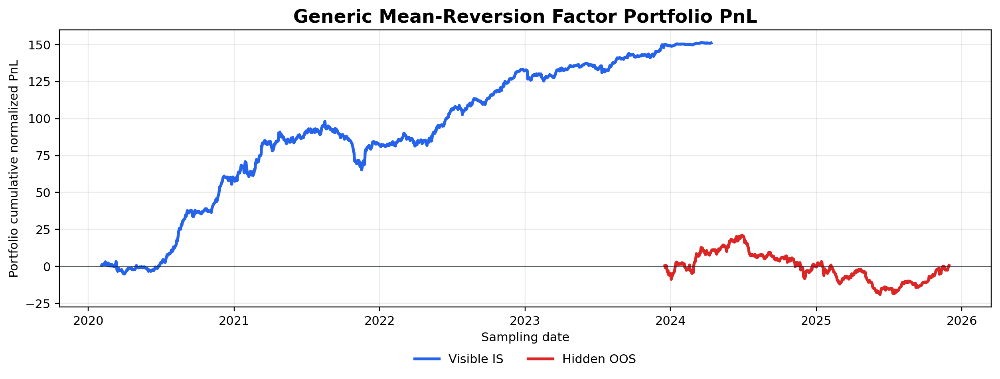

### Causality Gate
Any saved candidate whose latest causality-gated verifier replay failed is
excluded from the scored out-sample stream pool before aggregation because it is
contaminated with causality-breaking data. The failure remains visible in the
causality failure tables and charts, but it does not contribute to cumulative
PnL, Sharpe, task-correlation, or generalization-gap summaries.
The gate is intentionally mechanical: it reruns a saved snapshot on a causal
feature view, perturbs current prediction-bar labels and future rows/labels,
and checks whether the prediction for the test bar changes or disappears.

Representative failures from the current replay attempts:

| Pattern | Example | Concrete cause |
| --- | --- | --- |
| Future dependency | Pi/DeepSeek on `signal-top-trader`, final Out Sample | Future-row/label perturbation changed 48 of 48 gate-row predictions. The snapshot computed per-ticker quantile clipping on the full input frame, so future rows could change current clipping thresholds. |
| Same-bar label dependency | Gemini Flash on `signal-defillama`, final Out Sample | Current-label perturbation changed 48 of 48 predictions. The snapshot used the current prediction-bar `residual_return` as a feature instead of using a causal lag. |
| No causal output | Gemini Flash on `signal-top-trader`, final Out Sample | The causal feature view expected 48 gate rows, but the snapshot returned 0 finite predictions because its feature construction produced non-finite signals for the whole gate bar. |
| Runtime errors | Codex GPT-5.3 on `signal-beta`, iteration 2 | Polars could not resolve `mkt_ret_neg`; the snapshot referenced that derived column inside the same projection that created it. |


## Benchmark Results


The headline table below shows budget-end out-sample results with final-submission verifier replay overlaid onto the endpoint iteration. PnL is final
average cumulative normalized PnL. Portfolio Sharpe is the Sharpe of the
date-level average PnL curve after streams are blended. Pooled Sharpe treats all
stream-normalized daily returns as one stream-day distribution.
Offdiag corr. is the average off-diagonal out-sample correlation between
task-level PnL streams for the same model and endpoint. In the iteration plots,
iterations 2-4 are per-iteration replay snapshots, while iterations 1 and 5 use final-submission replay for the corresponding budget.

| Model | Iter. 1 PnL | Iter. 1 pooled Sh. | Iter. 1 portfolio Sh. | Iter. 1 offdiag corr. | Iter. 5 PnL | Iter. 5 pooled Sh. | Iter. 5 portfolio Sh. | Iter. 5 offdiag corr. |
| --- | ---: | ---: | ---: | ---: | ---: | ---: | ---: | ---: |
| Claude Sonnet 4.6 | 5.22 | 0.16 | 0.82 | 0.02 | 11.40 | 0.33 | 1.23 | 0.07 |
| Pi / DeepSeek V4 Pro | 2.52 | 0.07 | 0.30 | 0.07 | 6.45 | 0.19 | 0.98 | 0.05 |
| Codex GPT-5.3 | 6.32 | 0.18 | 1.14 | 0.01 | -1.05 | -0.03 | -0.13 | 0.11 |
| Gemini Flash | -4.86 | -0.14 | -0.71 | 0.02 | -2.33 | -0.07 | -0.35 | 0.06 |
| Codex GPT-5.5 | 4.06 | 0.11 | 0.48 | 0.06 | 6.48 | 0.18 | 0.70 | 0.09 |

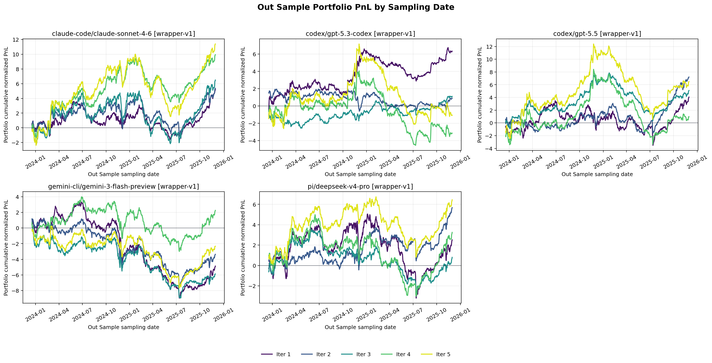


The in-sample companion table uses the same calculation on the release-present
budget-final attempts, using stored online `/check` in-sample streams where
available and replay-derived in-sample overlays for filled DeepSeek snapshots.

| Model | Iter. 1 In Sample PnL | Iter. 1 pooled Sh. | Iter. 1 portfolio Sh. | Iter. 1 streams | Iter. 1 offdiag corr. | Iter. 5 In Sample PnL | Iter. 5 pooled Sh. | Iter. 5 portfolio Sh. | Iter. 5 streams | Iter. 5 offdiag corr. |
| --- | ---: | ---: | ---: | ---: | ---: | ---: | ---: | ---: | ---: | ---: |
| Claude Sonnet 4.6 | 55.64 | 0.80 | 3.71 | 83 | 0.02 | 126.50 | 1.82 | 5.71 | 84 | 0.16 |
| Pi / DeepSeek V4 Pro | 66.56 | 0.95 | 3.88 | 88 | 0.06 | 94.20 | 1.34 | 5.47 | 75 | 0.09 |
| Codex GPT-5.3 | 51.43 | 0.72 | 3.85 | 85 | 0.01 | 97.38 | 1.37 | 3.88 | 89 | 0.20 |
| Gemini Flash | 70.98 | 0.99 | 3.35 | 83 | 0.11 | 80.70 | 1.14 | 4.21 | 86 | 0.12 |
| Codex GPT-5.5 | 65.87 | 0.93 | 3.26 | 86 | 0.07 | 130.75 | 1.84 | 5.42 | 89 | 0.16 |


We interpret the results along three axes: performance per iteration,
generalization from in-sample feedback to out-sample replay, and convergence toward
common signal families. This framing separates raw score improvements from the
more important question of whether the model used feedback to discover a robust
idea.


### Iterations vs. Performance

Almost every model besides Codex GPT-5.3 improves out-sample Sharpe by the
fifth iteration, but the path is not monotonic. DeepSeek and Claude recover strongly
after intermediate drift, GPT-5.5 improves with a large second-iteration jump and a
later recovery, Gemini remains negative, and Codex GPT-5.3 degrades under
iteration. The key result is not that more iterations mechanically help; it is that
models differ in whether they can convert proxy feedback into a signal that
survives replay.

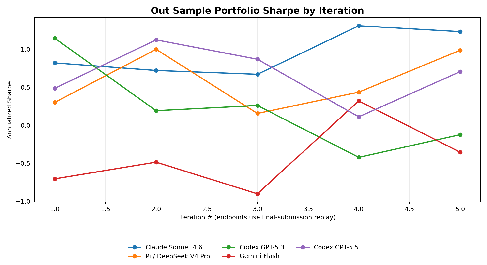

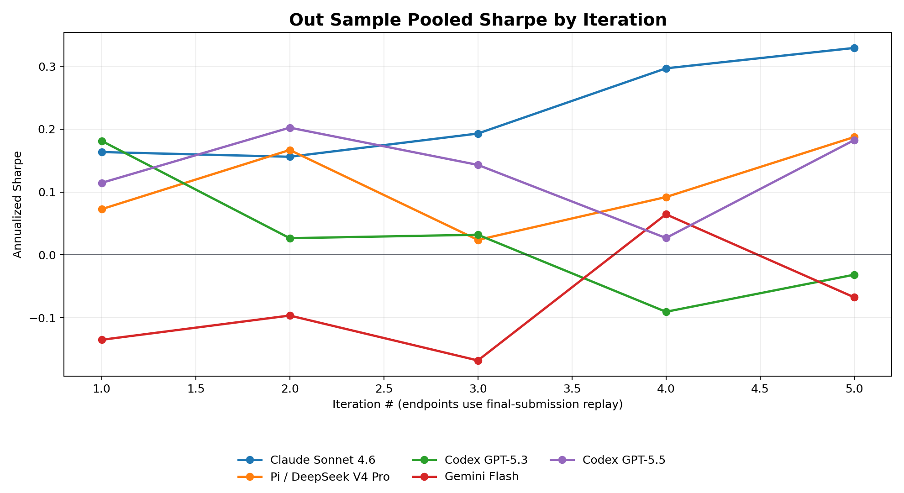

We saw a loose relationship between in-sample Sharpe and out-sample Sharpe by
attempt. The per-attempt Sharpe diagnostics below are clipped to +/-5 for
display and summary so very short or nearly flat streams cannot dominate the
chart; the raw PnL streams and portfolio headline curves are not clipped.
Scatter-panel annotations report Pearson `r`, the corresponding correlation
t-statistic, and the number of plotted points.

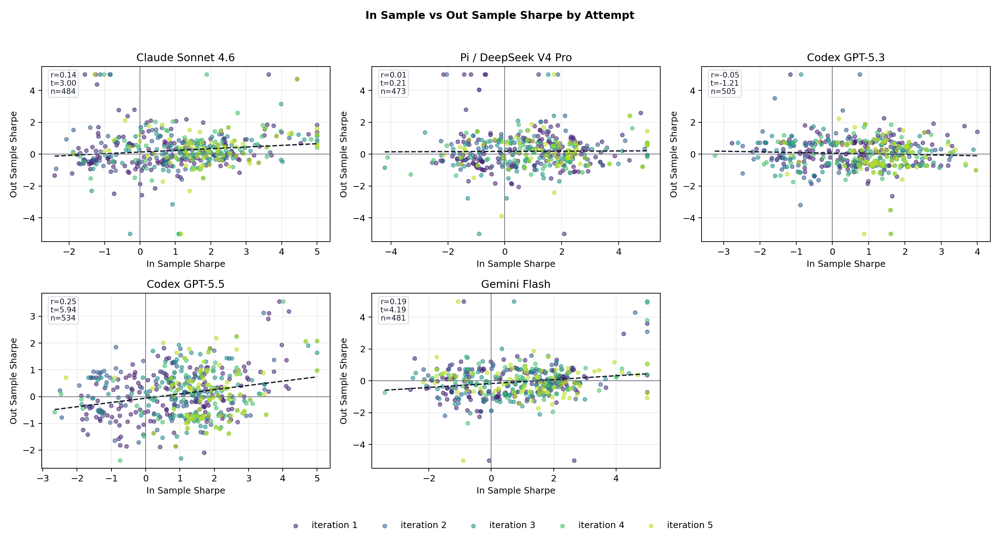

### Cross-Correlation and Hidden Factors
We saw evidence that models converge toward more common factors over the course
of in-sample iteration, as indicated by increasing off-diagonal correlations in
out-sample task PnL:

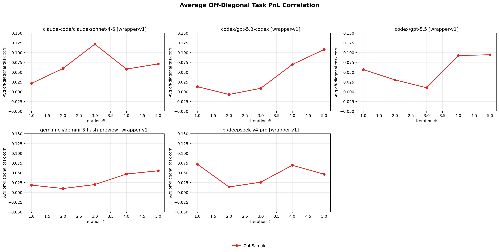 

This partly reflects a systematic increase in correlation to the generic
mean-reversion factor. Codex GPT-5.5 is the main exception: it started with a
high mean-reversion correlation and reduced it through iteration.
DeepSeek's iteration-5 performance should therefore be read with this caveat: a
material share of its out-sample lift appears to come from rediscovering or
leaning into residual-return mean reversion rather than from a fully
differentiated signal family. In the endpoint-overlaid baseline diagnostic,
Pi / DeepSeek V4 Pro has an iteration-5 average correlation to the generic
mean-reversion factor of about 0.25 across the 18 tasks.

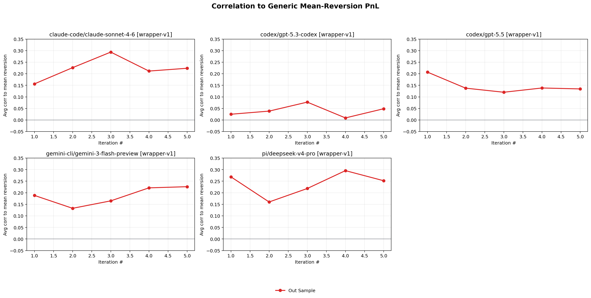


### Measuring Iteration Quality and Size

#### Bigger In Sample Improvements Translate Weakly
Improvement in In Sample Sharpe relative to the iteration-1 attempt is only a weak
indicator of out-sample improvement. That still suggests some real hill-climbing
under a difficult task, but the relationship is not strong enough to treat
visible improvement as reliable evidence of transfer.

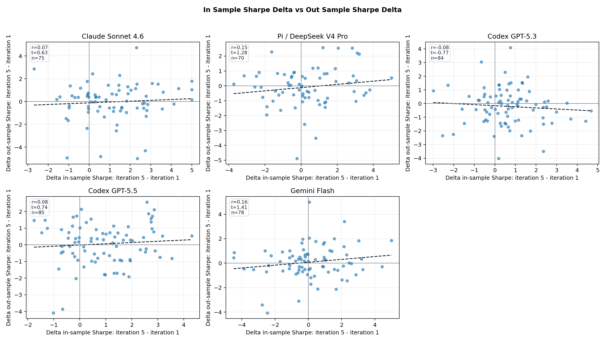


#### Serial Correlation and Edit Distance

A key question is whether the size of a model's edit step predicts actual
performance. One useful proxy for edit distance is the correlation between the
PnL streams of adjacent attempts. The average correlation between attempts T and
T+1 is often around 50%:

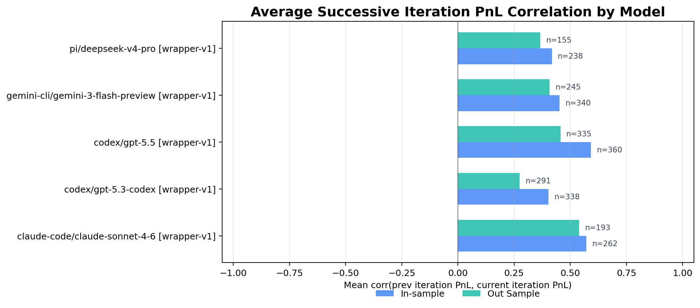

Larger signal changes tend to produce larger In Sample Sharpe changes. The same
relationship appears in out-sample, but it is much weaker.

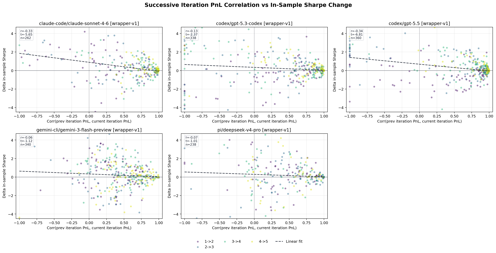

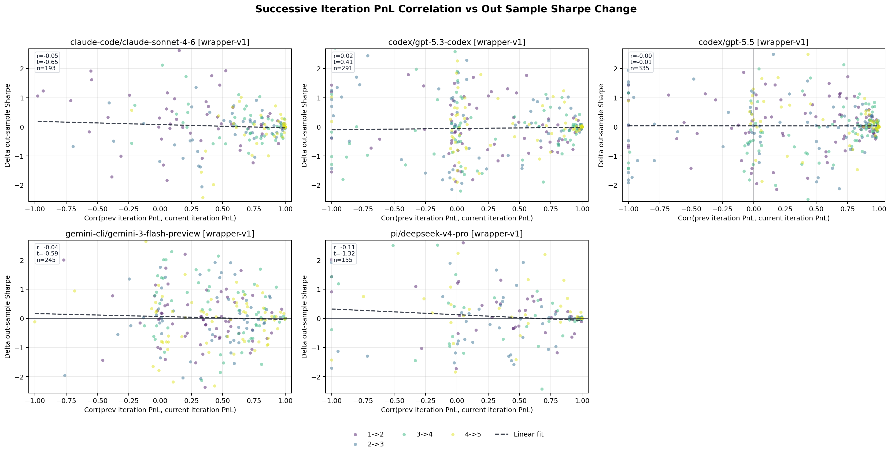

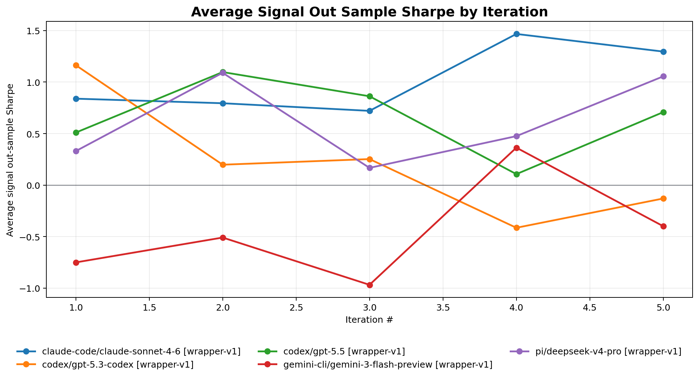


#### Causality Gate Failures
We saw little relationship between iteration number and causality-gate failure.
That suggests the measured iteration effects are not mainly driven by models
learning to exploit causal leakage.
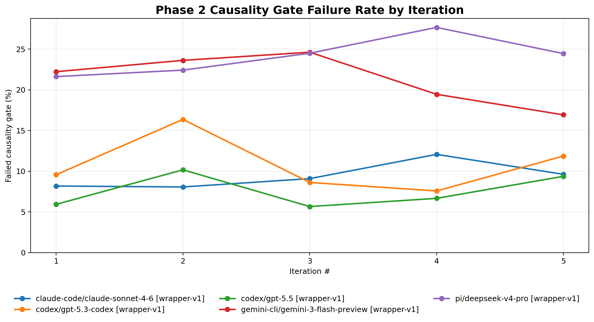


### Model Variance

We saw little relationship between attempt number and PnL variance, which
supports the normalization scheme and makes iteration-level comparisons more
consistent.

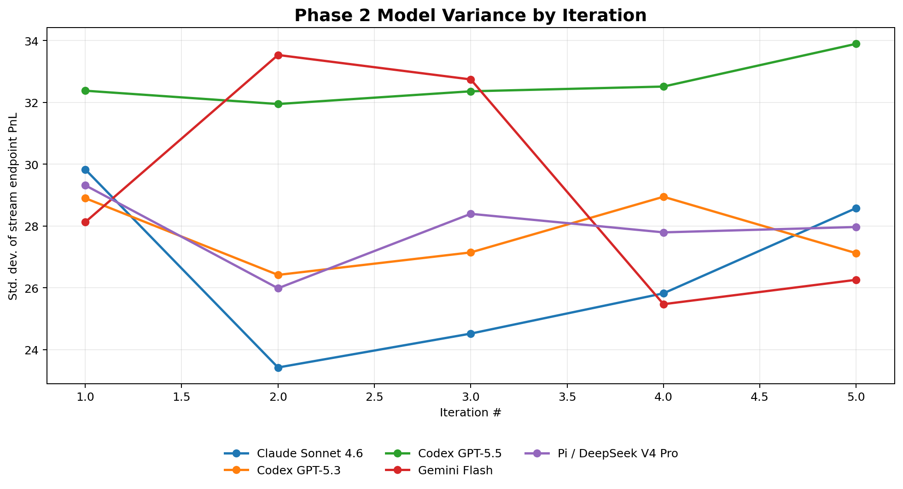

## Split Robustness Experiments

We ran a second set of tests with Codex GPT-5.5 and Gemini 3 Flash to measure
how much the sampling scheme changes the results:

1. Random blocks hold out contiguous random time windows from each task. This keeps realistic temporal structure inside the holdout, but varies which market regimes are hidden from the agent.

2. Stripes hold out recurring calendar slices, such as alternating months or weeks. This tests whether a signal generalizes across repeated seasonal slices rather than one continuous future period.

3. Train / validation / test adds a self-validation split: agents see train feedback, can reason against a validation-style proxy, and are then judged on a separate hidden test period. This is closer to a research workflow where iteration uses one proxy and final scoring asks whether the idea survives another unseen slice.

We treat random-block and stripe splits as acausal resampling tests because they
change which historical slices are hidden from the agent. We treat the
train/validation/test split as the causal diagnostic because it preserves a
final hidden test period while adding a separate visible validation channel.

### Acausal Splits

The acausal split table mirrors the headline result format at the two displayed
budgets. These rows use the causality-filtered out-sample portfolio curves for
random-block and stripe holdouts; Sharpe is portfolio Sharpe on the
date-level blended return curve.

| Model | Split | Iter. 1 Out Sample PnL | Iter. 1 portfolio Sh. | Iter. 5 Out Sample PnL | Iter. 5 portfolio Sh. |
| --- | --- | ---: | ---: | ---: | ---: |
| Codex GPT-5.5 | Random block | 23.91 | 2.76 | 28.98 | 3.04 |
| Codex GPT-5.5 | Stripe | 33.55 | 3.04 | 42.67 | 4.07 |
| Gemini Flash | Random block | 8.39 | 1.29 | 9.16 | 1.69 |
| Gemini Flash | Stripe | 8.22 | 1.14 | 17.62 | 2.33 |

The same acausal streams are also sliced to sampling dates from 2024-01-01
through 2025-11-30. This diagnostic keeps the existing per-stream
normalization, then aggregates only the later out-sample dates, so it asks whether the
full-window split result is concentrated in the earlier market regime. We saw
stronger performance on stripe splits than on random-block splits, likely
because stripe splits blend regimes between in-sample and out-of-sample
windows. We also saw more effective hill-climbing in these resampling tests:
Out Sample Sharpes are higher and correspond more clearly with large In Sample increases.

| Model | Split | Iter. 1 2024+ PnL | Iter. 1 2024+ portfolio Sh. | Iter. 5 2024+ PnL | Iter. 5 2024+ portfolio Sh. |
| --- | --- | ---: | ---: | ---: | ---: |
| Codex GPT-5.5 | Random block | 4.67 | 1.20 | -0.18 | -0.04 |
| Codex GPT-5.5 | Stripe | 4.97 | 1.25 | 3.83 | 0.94 |
| Gemini Flash | Random block | 0.57 | 0.17 | 0.15 | 0.06 |
| Gemini Flash | Stripe | -0.72 | -0.22 | 4.45 | 1.58 |

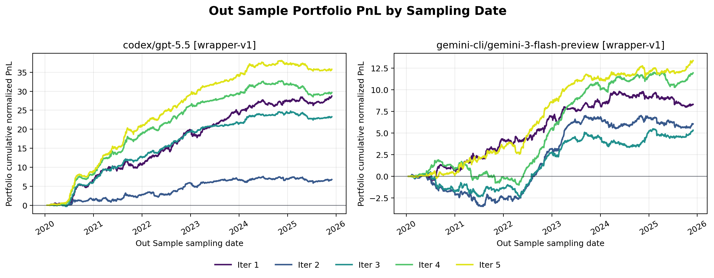

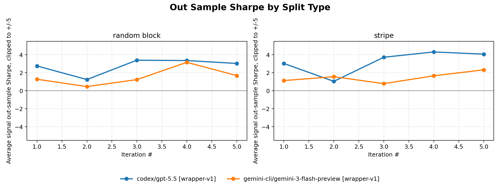

We saw a stronger relationship between In Sample and Out Sample signal Sharpes in the acausal
split experiments:

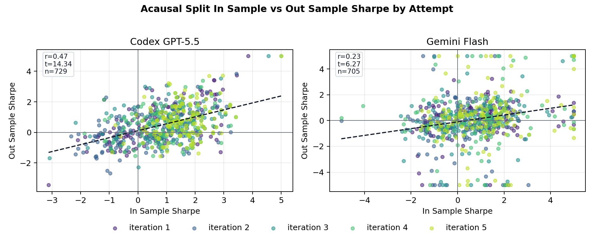


We also saw a more significant relationship between edit size and the change in
Out Sample Sharpe in these experiments:

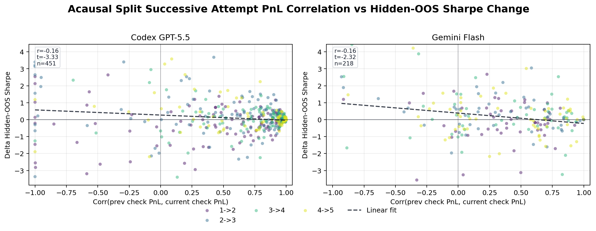

The task-correlation and mean-reversion diagnostics suggest that the same
hidden-factor and generic reversal structure is still present under these
sampling schemes.

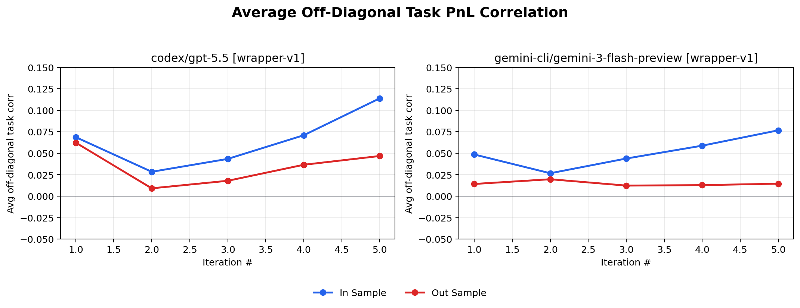

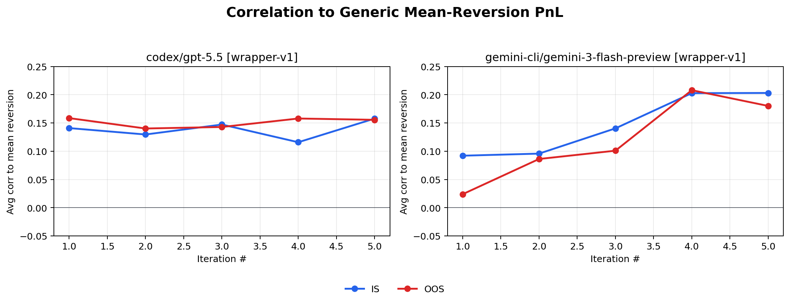


## Train-Val-Test Split

In the train/validation/test variant, each task is split into three chronological roles rather than the usual visible/hidden pair.

During the online run, the agent still interacts through `/check`, but the
feedback surface is split conceptually into two visible evaluation surfaces. The train
evaluator is the primary feedback channel: it scores the submitted signal on the
training window and gives the usual proxy metrics such as Sharpe, IC,
calibration, and PnL diagnostics. A second validation evaluator evaluates the same
submitted signal on a held-out validation window that is still part of the
online research loop. The agent can use that validation feedback to decide
whether a signal is merely fitting the train window or appears to transfer to a
nearby unseen slice.

The final benchmark score is then computed separately by the canonical replay
verifier on the hidden test window. That test window is not available during
iteration and is the actual out-of-distribution outcome used for the report.
The structure is:

train feedback -> validation feedback -> hidden test verifier replay

The point is to separate "can the model improve on the data it is optimizing
against?" from "can it use a validation proxy to make better research decisions
before touching the final hidden test?"

Concretely, the run uses an interleaved-validation harness with
`validation_split = "is-month-stripe"` and `max_val_checks = 3`. `/check` was
the normal train-window evaluator and counted against the ordinary iteration budget.
`/check-val` is a separate validation-window evaluator on the same candidate
code, but it is gated by train iterations: the agent can only call `/check-val`
when the number of validation iterations already used was lower than the number of
normal `/check` calls already used. The harness also reserves one validation
iteration as a final guard, so with `max_val_checks = 3` the agent could spend at
most two interleaved validation iterations during search. We launched 18 signal
tasks for Codex GPT-5.5 and Gemini Flash, with normal iteration budgets `1` and
`5`, and `2` repeats per model/task/budget. We use the same out-of-sample dates
as the original experiment, but split the original train window into train and
validation stripes.

| Model | Iter. 1 test PnL | Iter. 1 pooled Sh. | Iter. 1 portfolio Sh. | Iter. 5 test PnL | Iter. 5 pooled Sh. | Iter. 5 portfolio Sh. |
| --- | ---: | ---: | ---: | ---: | ---: | ---: |
| Codex GPT-5.5 | -4.67 | -0.13 | -0.57 | -3.51 | -0.10 | -0.29 |
| Gemini Flash | 8.09 | 0.23 | 0.76 | -10.69 | -0.30 | -1.10 |

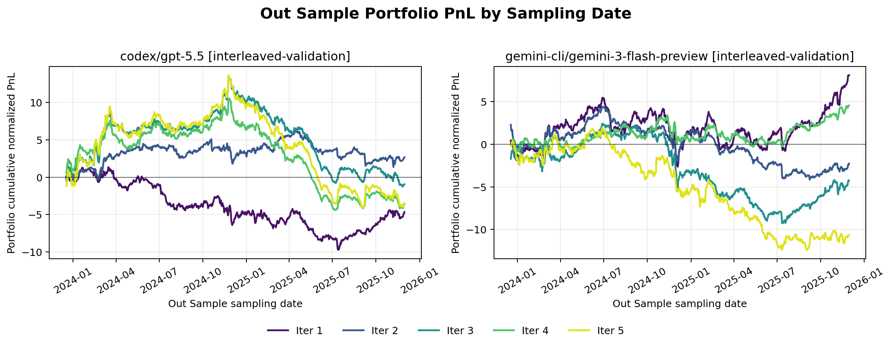


This is a weak transfer result. The agents can use train and validation feedback
to improve proxy scores, but they do not reliably convert that feedback into
hidden-test performance. One plausible interpretation is that the validation
split reduces the amount of train data available for search while still giving
only a noisy proxy for the final hidden test.
With final replay overlaid onto the endpoint iterations, Codex GPT-5.5 remains
negative on the hidden test set at both displayed budgets, improving only
slightly from iteration 1 to iteration 5. Gemini Flash moves the other way: its
iteration-1 endpoint is positive, but its iteration-5 endpoint is materially negative.
That pattern reinforces the main point of this section: extra train and
validation feedback can raise visible proxy scores without reliably improving
the final hidden test result.

The models were still able to hill-climb on the train surface:

| Model | Iter. 1 visible PnL | Iter. 1 pooled Sh. | Iter. 1 portfolio Sh. | Iter. 5 visible PnL | Iter. 5 pooled Sh. | Iter. 5 portfolio Sh. |
| --- | ---: | ---: | ---: | ---: | ---: | ---: |
| Codex GPT-5.5 | 5.59 | 0.32 | 0.99 | 33.92 | 1.92 | 4.48 |
| Gemini Flash | 6.17 | 0.35 | 1.83 | 14.50 | 0.83 | 3.63 |

The validation-feedback table is mixed. Codex GPT-5.5 improves substantially on
the validation holdout, while Gemini Flash declines from the iteration-1 validation
snapshot to the iteration-5 validation snapshot.

| Model | Iter. 1 val PnL | Iter. 1 pooled Sh. | Iter. 1 portfolio Sh. | Iter. 5 val PnL | Iter. 5 pooled Sh. | Iter. 5 portfolio Sh. |
| --- | ---: | ---: | ---: | ---: | ---: | ---: |
| Codex GPT-5.5 | 14.93 | 0.82 | 3.10 | 26.28 | 1.43 | 4.16 |
| Gemini Flash | 13.97 | 0.79 | 3.43 | 6.32 | 0.45 | 1.64 |

The diagnostic plot shows weaker train-to-test correlation than the baseline
experiment. This may partly reflect the smaller sample size and the fact that
the train window has been split into separate train and validation stripes.

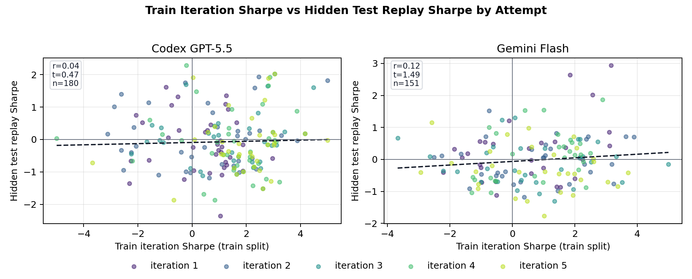


## Reproducibility and Benchmark

The public benchmark package is released separately as RegimeBench
[`v0.1.2`](https://github.com/tincans-ai/regime-bench/releases/tag/v0.1.2).
That release contains the 18 public `signal-*` tasks, base train/test parquet
files, local task runner and split materialization tooling, and the canonical
public PnL verifier with the bar-level causality gate enabled by default. The
verifier runs saved-code replay in strict mode, so hidden/out-sample current-return
labels are withheld from `build_signal(data_path)` during scoring.

The release data lives in the Hugging Face dataset
[`amitvpatel06/regime-bench`](https://huggingface.co/datasets/amitvpatel06/regime-bench)
at revision `eb359fb35abc99930b76cb1bf3495949b98d5376` as the
`regime-bench-base-data` bundle. It includes 36 parquet files and excludes
reference solutions, private orchestration code, worker credentials, raw
provider logs, and any hosted blind leaderboard machinery. Because hidden/Out Sample
labels are included for reproducibility, results from this package should be
described as local-method comparison or reproducibility results rather than as
blind leaderboard scores.


## Future Work

This release treats RegimeBench as an initial measurement of automated research
judgment under distribution shift. The most important next question is whether
models can improve that judgment through better research process rather than
through more local optimization. A natural follow-up is to compare process
interventions such as explicit hypothesis archives, conservative stopping,
self-validation, debate-style critique, and population-based search. The goal
would not be to find a cleverer prompt wrapper, but to ask whether structured
deliberation changes the exploration/exploitation tradeoff: do agents preserve
diverse hypotheses, recognize misleading feedback, and stop before visible
proxy gains become out-sample losses?

A second research direction is transfer. The baseline results suggest that
agents often converge toward shared factor families, especially simple
mean-reversion-like structure. Future experiments should test whether models
can learn more abstract research lessons across tasks without collapsing into
factor imitation or leaking task-specific answers. This requires a carefully
audited memory setting in which previous trajectories are summarized into
portable lessons, then evaluated on held-out tasks and split regimes. The
central question is whether memory helps agents form better hypotheses under a
new distribution, or merely makes them more confident in familiar but fragile
strategies.

Finally, RegimeBench can support research on learned research policies. The
recorded trajectories capture decisions about hypothesis revision, feedback
seeking, candidate selection, and stopping. That makes them a candidate
substrate for offline policy learning or imitation learning over the research
process itself. The right target is not a model trained to exploit this
particular benchmark, but a controller that learns general principles for
allocating scarce experiments under noisy feedback. Any such study should keep
training trajectories, replay overlays, and evaluation splits sharply separated,
so improvement reflects better out-of-distribution judgment rather than
benchmark memorization.


## Appendix: Experiment Specifications

Table A1 lists the full run specification for the experiment suites summarized
above.

| Suite | Models | Task/Split Setup | In Sample / Validation Dates | Out Sample Dates | Iterations / Repeats |
|---|---|---|---|---|---|
| Baseline Run | Codex GPT-5.3, Codex GPT-5.5, Claude Code / Claude Sonnet 4.6, DeepSeek V4 Pro, Gemini Flash | 18 base `signal-*` RegimeBench tasks, no split variants | Aggregate In Sample PnL artifacts cover 2020-01-16 to 2024-04-12 | Canonical out-sample replay covers 2023-12-18 to 2025-11-30 | Budgets 1 and 5 iterations; 5 repeats per model/task/budget |
| Split Robustness | Codex GPT-5.5, Gemini Flash | Random-block and stripe split variants of the 18 signal tasks; rolling splits are excluded from the reported view | Random-block splits hold out selected date blocks, so In Sample is the complement rather than one contiguous window. Stripe splits alternate month/week stripes within each task | Random-block held-out blocks start between 2020-06-01 and 2022-06-01 and end between 2024-09-30 and 2025-11-30. Stripe Out Sample uses the held-out stripe | Budgets 1 and 5 iterations; 2 repeats per model/task/budget |
| Train / Val / Test Split | Codex GPT-5.5, Gemini Flash | 18 base signal tasks with an interleaved validation harness; validation is a month-stripe holdout from the in-sample data | Training stripe spans 2020-01-16 to 2024-03-31 across tasks. Validation stripe spans 2020-02-01 to 2024-04-12. Agents may use up to 3 `/check-val` calls | Final canonical out-sample replay covers 2023-12-18 to 2025-11-30 | Budgets 1 and 5 iterations; 2 repeats per model/task/budget; max 3 validation iterations |
| Varied Stopping Policies | Codex GPT-5.3, Codex GPT-5.5, Claude Code / Claude Sonnet 4.6, DeepSeek V4 Pro, Gemini Flash | Replay-only study over saved 5-iteration baseline trajectories; no new code generation | Same online In Sample trajectories as the Baseline Run | Same canonical out-sample replay window as the Baseline Run, 2023-12-18 to 2025-11-30 | 5-iteration trajectories only; 5 baseline repeats per model/task; policies are best-visible, conservative, and optional-stop |
